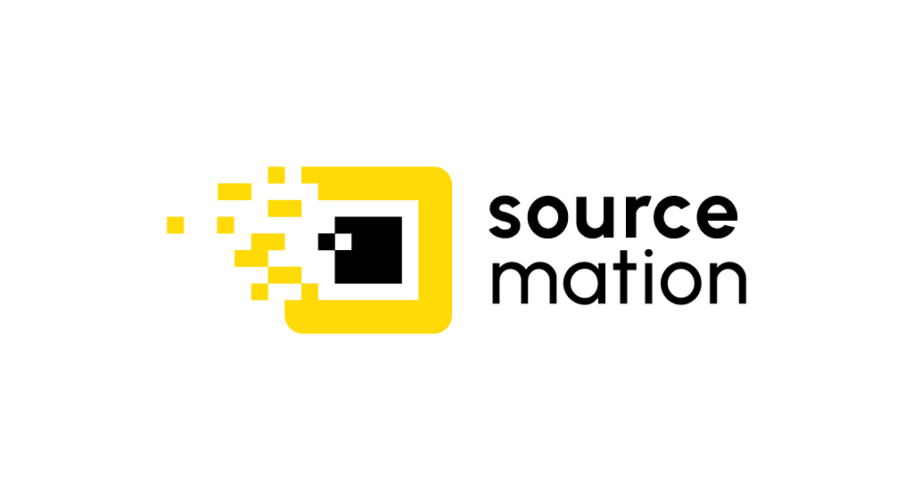

# SourceMation

[SourceMation](https://sourcemation.com) is a platform providing the images for
various platforms including Docker, Kubernetes, Vagrant, WSL, VirtualBox,
VMware, and more. It offers a wide range of pre-configured regurally updated
images for different use cases.

Newest builds of the images are freely available on Docker Hub and Quay.io as
well as our charts registry and other repositories.

## Open Source Risk analysis

The most innovative feature of SourceMation is scoring system, that based on
verificable metrics, allows us to asses and rank the open source projects and
software in general, it's essential when selecting software for our images and
helps us to maintain and benchmark the risks associated with using open source
software.

## Singel source of truth

SourceMation is used as the single source of images for our clients and
partners, simplifying the supply chain, mitigating the risks and ensuring
consistency across the board. This approach helps to streamline the DevSecOps
operations and improve the overall security posture.
